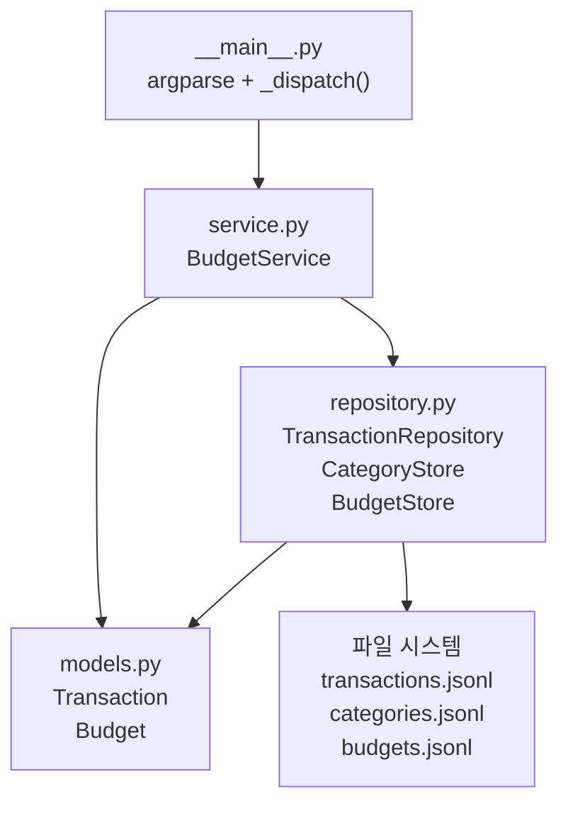
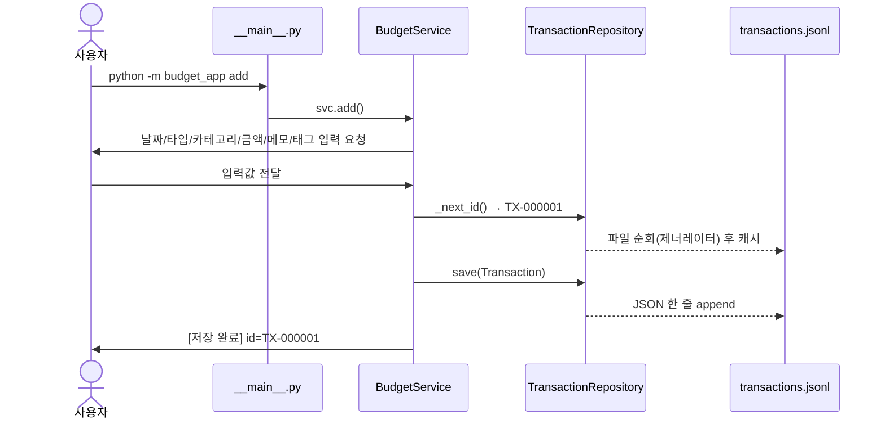
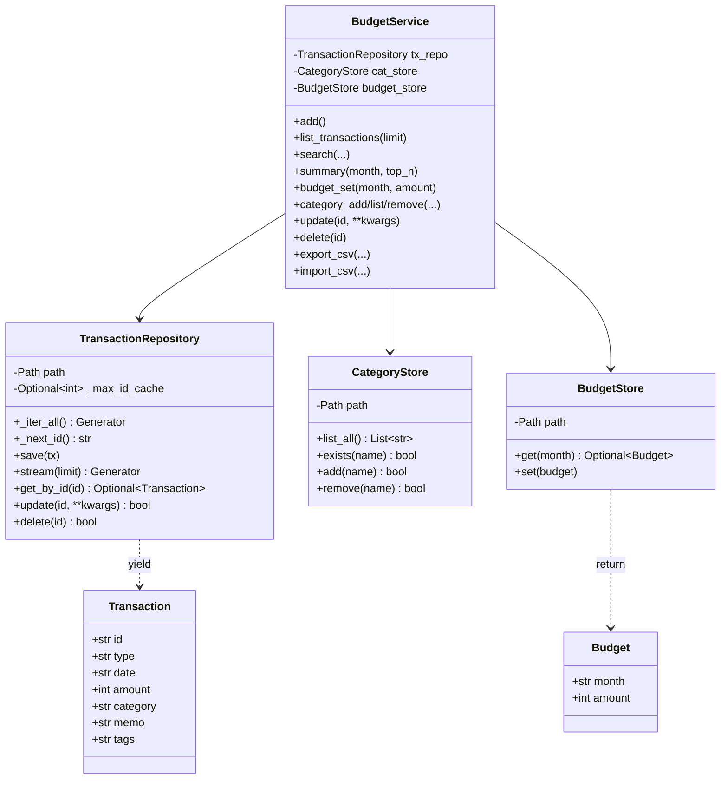

# 구조도

## 모듈 의존 관계

```mermaid
flowchart TD
    MAIN["__main__.py\nargparse + _dispatch()"] --> SVC["service.py\nBudgetService"]
    SVC --> REPO["repository.py\nTransactionRepository\nCategoryStore\nBudgetStore"]
    SVC --> MOD["models.py\nTransaction\nBudget"]
    REPO --> MOD
    REPO --> FS["파일 시스템\ntransactions.jsonl\ncategories.jsonl\nbudgets.jsonl"]
```

## 실행 흐름 — add 예시

```mermaid
sequenceDiagram
    actor 사용자
    participant CLI as __main__.py
    participant SVC as BudgetService
    participant REPO as TransactionRepository
    participant FS as transactions.jsonl

    사용자->>CLI: python -m budget_app add
    CLI->>SVC: svc.add()
    SVC->>사용자: 날짜/타입/카테고리/금액/메모/태그 입력 요청
    사용자->>SVC: 입력값 전달
    SVC->>REPO: _next_id() → TX-000001
    REPO-->>FS: 파일 순회(제너레이터) 후 캐시
    SVC->>REPO: save(Transaction)
    REPO-->>FS: JSON 한 줄 append
    SVC->>사용자: [저장 완료] id=TX-000001
```

## 클래스 구조

```mermaid
classDiagram
    class Transaction {
        +str id
        +str type
        +str date
        +int amount
        +str category
        +str memo
        +str tags
    }
    class Budget {
        +str month
        +int amount
    }
    class TransactionRepository {
        -Path path
        -Optional~int~ _max_id_cache
        +_iter_all() Generator
        +_next_id() str
        +save(tx)
        +stream(limit) Generator
        +get_by_id(id) Optional~Transaction~
        +update(id, **kwargs) bool
        +delete(id) bool
    }
    class CategoryStore {
        -Path path
        +list_all() List~str~
        +exists(name) bool
        +add(name) bool
        +remove(name) bool
    }
    class BudgetStore {
        -Path path
        +get(month) Optional~Budget~
        +set(budget)
    }
    class BudgetService {
        -TransactionRepository tx_repo
        -CategoryStore cat_store
        -BudgetStore budget_store
        +add()
        +list_transactions(limit)
        +search(...)
        +summary(month, top_n)
        +budget_set(month, amount)
        +category_add/list/remove(...)
        +update(id, **kwargs)
        +delete(id)
        +export_csv(...)
        +import_csv(...)
    }
    BudgetService --> TransactionRepository
    BudgetService --> CategoryStore
    BudgetService --> BudgetStore
    TransactionRepository ..> Transaction : yield
    BudgetStore ..> Budget : return
```
